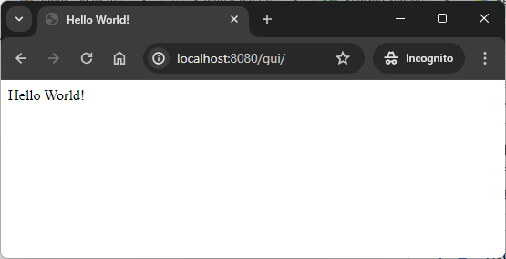

USAGE COMMANDS
--------------

> Please be aware that following tools should be installed in advance on your computer: **Java**, **Maven** and **Git**. 

> Please **clone/download** project, open **project's main folder** in your favorite **command line tool** and then **proceed with steps below**. 

Usage steps:
1. In a command line tool create package with `mvn clean package`
1. In a command line tool start application with `java -jar pm.jar --deploy .\target\gui.war --port 8080`
1. In a http browser (e.g. Chrome) visit `http://localhost:8080/gui`
   * Expected HTML page **Hello World!**
1. Clean up environment 
     * In a command line tool stop application with `ctrl + C`

USAGE IMAGES
------------

DESCRIPTION
-----------

##### Goal
The goal of this project is to present how to display content in simple **response** in a **GUI HTML Java** application with usage **Java EE 9** framework. Application is deployed on **payara micro** in version 6.

**Content of response** is retured by servlet and developer can define what should be inside.

##### Flow
The following flow takes place in this project:
1. User via any browser sends request to application for a content.
1. Application returns response with JSON containing message "Hello World"!. This response is presented to User via browser.

##### Launch
To launch this application please make sure that the **Preconditions** are met and then follow instructions from **Usage** section.

##### Technologies
This project uses following technologies:
* **Java EE 9** framework

PRECONDITIONS
-------------

##### Preconditions - Tools
* Installed **Operating System** (tested on Windows 10)
* Installed **Java** (tested on version 11.0.16.1). Tool details: `https://docs.google.com/document/d/119VYxF8JIZIUSk7JjwEPNX1RVjHBGbXHBKuK_1ytJg4/edit?usp=sharing`
* Installed **Maven** (tested on version 3.8.5). Tool details: `https://docs.google.com/document/d/1cfIMcqkWlobUfVfTLQp7ixqEcOtoTR8X6OGo3cU4maw/edit?usp=sharing`
* Installed **Git** (tested on version 2.33.0.windows.2). Tool details: `https://docs.google.com/document/d/1Iyxy5DYfsrEZK5fxZJnYy5a1saARxd5LyMEscJKSHn0/edit?usp=sharing`

##### Preconditions - Actions
* **Download** source code using Git 
* Open any **Command Line** (for instance "Windonw PowerShell" on Windows OS) tool on **project's folder**.

ADDITIONAL INFO
---------------

Used archetype:
* mvn archetype:generate -DarchetypeGroupId=com.airhacks -DarchetypeArtifactId=javaee8-essentials-archetype -DarchetypeVersion=0.0.1