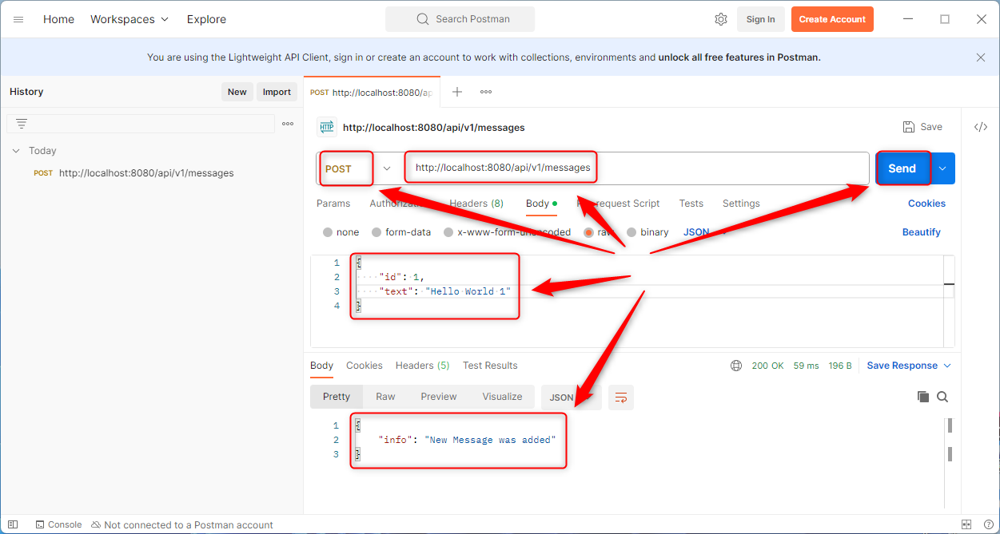
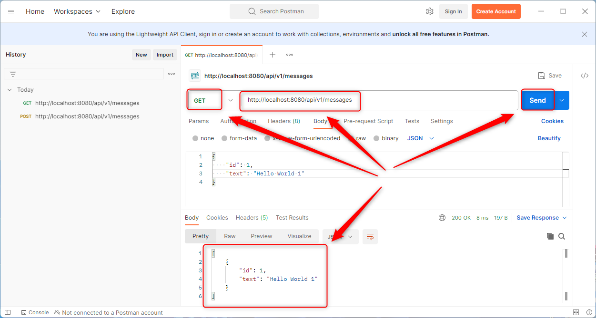
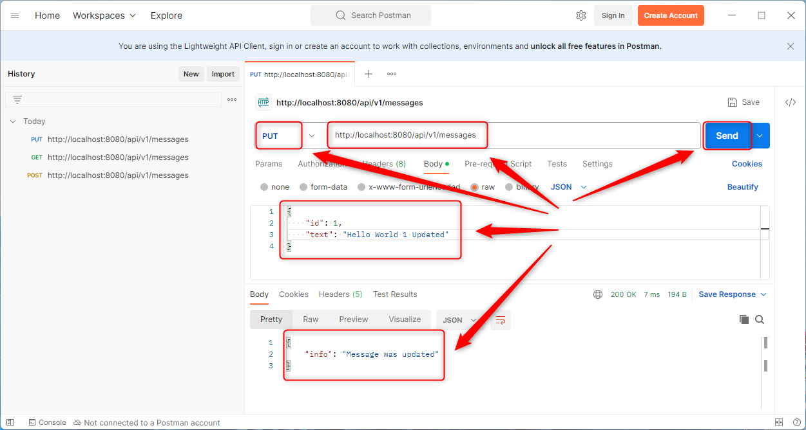
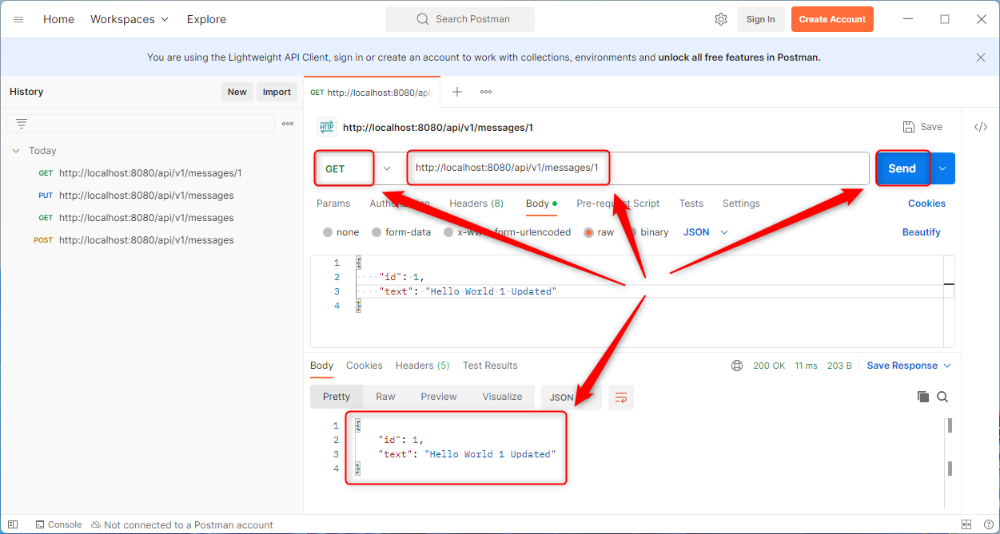
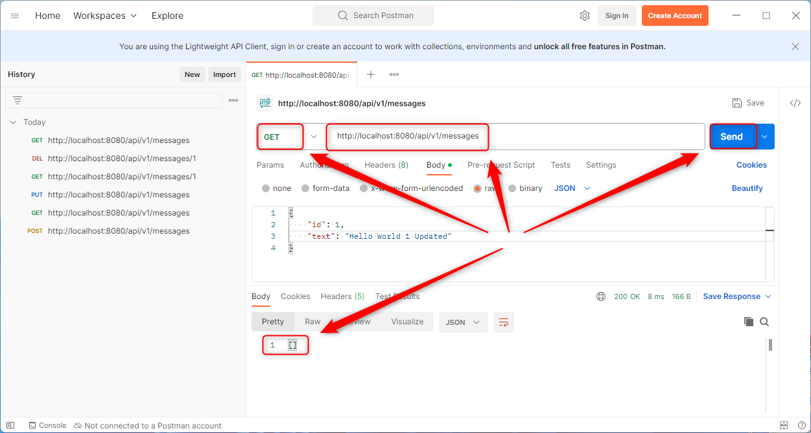

USAGE COMMANDS
--------------

> Please be aware that following tools should be installed in advance on your computer: **Java**, **Maven** and **Git**. 

> Please **clone/download** project, open **project's main folder** in your favorite **command line tool** and then **proceed with steps below**. 

Usage steps:
1. In a command line tool create package with `mvn clean package`
1. In a command line tool start application with `java -jar pm.jar --deploy .\target\rest.war --port 8080`
1. In a http client (e.g. Postman) use **POST** method and visit `http://localhost:8080/rest/v1/messages`
   * Choose **Body -> raw -> JSON** and add following JSON:
   ```
   {
    "id": 1,
    "message": "Hello World 1"
   }
   ```
   * Expected message **New Message was added**
1. In a http client (e.g. Postman) use **GET** method and visit `http://localhost:8080/rest/v1/messages`
   * Expected following JSON:
   ```
   [
      {
      "id": 1,
      "message": "Hello World"
      }
   ]
   ```
1. In a http client (e.g. Postman) use **PUT** method and visit `http://localhost:8080/rest/v1/messages`
   * Choose **Body -> raw -> JSON** and add following JSON:
   ```
   {
    "id": 1,
    "message": "Hello World Updated"
   }
   ```
   * Expected message **Message was updated**
1. In a http client (e.g. Postman) use **GET** method and visit `http://localhost:8080/rest/v1/messages/1`
   * Expected following JSON:
   ```   
   {
     "id": 1,
     "message": "Hello World Updated"
   }   
   ```
1. In a http client (e.g. Postman) use **DELETE** method and visit `http://localhost:8080/rest/v1/messages/1`
   * Expected message **Message was deleted**
1. In a http client (e.g. Postman) use **GET** method and visit `http://localhost:8080/rest/v1/messages`
   * Expected **empty list**
1. Clean up environment 
     * In a command line tool stop application with `ctrl + C`


USAGE IMAGES
------------













DESCRIPTION
-----------

##### Goal
The goal of this project is to present how to implement **CRUD** (Create, Read, Update, Delete) operations in an application **REST API** in **Java** programming language with usage **Java EE 9** framework. This application enables adding, reading, updating and deleting messages.

Application is deployed on **payara micro** in version 6.

##### Flow
The following flow takes place in this project:
1. User via any http client sends request to application with specific CRUD action: Create, Read, Update or Delete.
1. Application performs specific CRUD action.
1. Application sends back response to user via http client with message. This message is different and depends on specific CRUD action.

##### Launch
To launch this application please make sure that the **Preconditions** are met and then follow instructions from **Usage** section.

##### Technologies
This project uses following technologies:
* **Java EE 8** framework
* **Java**: `https://docs.google.com/document/d/119VYxF8JIZIUSk7JjwEPNX1RVjHBGbXHBKuK_1ytJg4/edit?usp=sharing`
* **Maven**: `https://docs.google.com/document/d/1cfIMcqkWlobUfVfTLQp7ixqEcOtoTR8X6OGo3cU4maw/edit?usp=sharing`
* **Git**: `https://docs.google.com/document/d/1Iyxy5DYfsrEZK5fxZJnYy5a1saARxd5LyMEscJKSHn0/edit?usp=sharing`


PRECONDITIONS
-------------

##### Preconditions - Tools
* Installed **Operating System** (tested on Windows 10)
* Installed **Java** (tested on version 11.0.16.1) 
* Installed **Maven** (tested on version 3.8.5)
* Installed **Git** (tested on version 2.33.0.windows.2)`


##### Preconditions - Actions
* **Download** source code using Git 
* Open any **Command Line** (for instance "Windonw PowerShell" on Windows OS) tool on **project's folder**.


ADDITIONAL INFO
---------------

Used archetype:
* mvn archetype:generate -DarchetypeGroupId=com.airhacks -DarchetypeArtifactId=javaee8-essentials-archetype -DarchetypeVersion=0.0.1