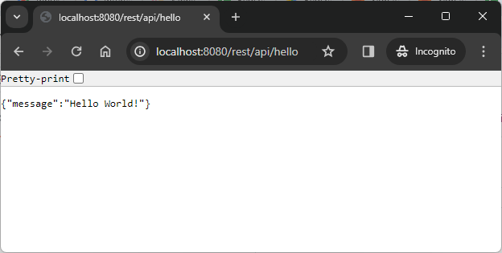

USAGE COMMANDS
--------------

> Please be aware that following tools should be installed in advance on your computer: **Java**, **Maven**, **Git** and **Docker**. Docker tool has to be **up and running**. 

> Please **clone/download** project, open **project's main folder** in your favorite **command line tool** and then **proceed with steps below**. 

Usage steps:
1. In a command line tool create package with `mvn clean package`
1. In a command line tool build Docker image with `docker build -t java-ee8-api-rest-helloworld-docker-simple-image .`
1. (Optional) In a command line tool check list of all images with `docker images`
   * Expected **list of all docker images** downloaded on a computer
1. In a command line tool start Docker container with `docker run -d -p 8080:8080 --name java-ee8-api-rest-helloworld-docker-simple-container java-ee8-api-rest-helloworld-docker-simple-image`
1. (Optional) In a command line tool check list of all containers with `docker ps -a`
   * Expected **list of all docker containers** installed on a computer
1. In a http browser (e.g. Chrome) visit `http://localhost:8080/rest/api/hello`
   * Expected JSON **{"message": "Hello World!"}**
1. (Optional) In a command line tool check application logs with `docker logs java-ee8-api-rest-helloworld-docker-simple-container`
   * Expected **application logs**
1. Clean up environment 
     * In a command line tool stop and remove Docker container with `docker rm -f java-ee8-api-rest-helloworld-docker-simple-container`
     * In a command line tool stop and remove Docker image with `docker rmi java-ee8-api-rest-helloworld-docker-simple-image`

USAGE IMAGES
------------

DESCRIPTION
-----------

##### Goal
The goal of this project is to present how to **dockerize** a **simple REST API Java** application using **Java EE 8** framework. This application returns JSON with the key "message" and the value **Hello World!** as the result of GET HTTP method.

Dockerize means that application is installed on Docker instead directly on computer. Application is deployed on a Docker Image of **payara micro** in version 5.

##### Flow
The following flow takes place in this project:
1. User via any browser sends request to application for a content.
1. Application returns response with JSON containing message "Hello World"!. This response is presented to User via browser.

##### Launch
To launch this application please make sure that the **Preconditions** are met and then follow instructions from **Usage** section.

##### Technologies
This project uses following technologies:
* **Java EE 8** framework
* **Java**: `https://docs.google.com/document/d/119VYxF8JIZIUSk7JjwEPNX1RVjHBGbXHBKuK_1ytJg4/edit?usp=sharing`
* **Maven**: `https://docs.google.com/document/d/1cfIMcqkWlobUfVfTLQp7ixqEcOtoTR8X6OGo3cU4maw/edit?usp=sharing`
* **Git**: `https://docs.google.com/document/d/1Iyxy5DYfsrEZK5fxZJnYy5a1saARxd5LyMEscJKSHn0/edit?usp=sharing`
* **Docker**: `https://docs.google.com/document/d/1tKdfZIrNhTNWjlWcqUkg4lteI91EhBvaj6VDrhpnCnk/edit?usp=sharing`

PRECONDITIONS
-------------

##### Preconditions - Tools
* Installed **Operating System** (tested on Windows 10)
* Installed **Java** (tested on version 11.0.16.1) 
* Installed **Maven** (tested on version 3.8.5) 
* Installed **Git** (tested on version 2.33.0.windows.2)
* Installed **Docker** (tested on version 4.24.2)

##### Preconditions - Actions
* **Download** source code using Git 
* Open any **Command Line** (for instance "Windonw PowerShell" on Windows OS) tool on **project's folder**.
* Docker tool has to be **up and running**. 

ADDITIONAL INFO
---------------

Used archetype:
* mvn archetype:generate -DarchetypeGroupId=com.airhacks -DarchetypeArtifactId=javaee8-essentials-archetype -DarchetypeVersion=0.0.1